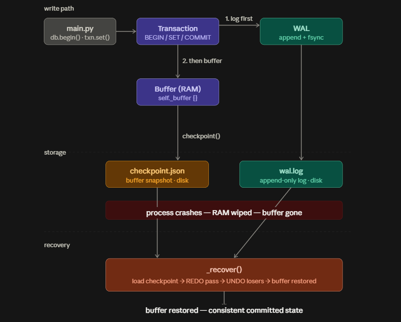

# toy-wal

A Write-Ahead Log (WAL) built from scratch in pure Python.

This is a learning project. The goal is to understand the mechanism behind crash recovery in databases like PostgreSQL: not by reading about it, but by implementing it.

---

## Background

When a database writes data, it faces a fundamental problem: what if the process dies halfway through a write? The disk ends up in a partially written, inconsistent state.

Write-Ahead Logging solves this with one rule:

> Before modifying any data, write a record describing the change to a log file — and make sure that record hits disk first.

If the process crashes mid-write, the log survives. On restart, the database reads the log and replays or undoes operations to restore a consistent state. The log is the source of truth.

This is how PostgreSQL guarantees the **D** in ACID — Durability.

---

## What This Implements

| Component | Description |
|---|---|
| `WAL` | Append-only log file. Every record is `fsync`'d to disk before returning. |
| `LogRecord` | A single log entry: LSN, transaction ID, operation, old value, new value. |
| `Transaction` | `BEGIN`, `SET`, `DELETE`, `COMMIT`, `ABORT` with context manager support. |
| `Database` | Key-value store backed by the WAL. Runs crash recovery on every startup. |
| Crash recovery | REDO committed changes, UNDO incomplete transactions. |
| Checkpoint | Flush buffer to disk, truncate old WAL records. |

---

## Project Structure

```
toy_wal/
├── toy_wal/
│   ├── __init__.py
│   ├── wal.py           # LogRecord, WAL: append, fsync, replay
│   ├── transaction.py   # Transaction: BEGIN/SET/DELETE/COMMIT/ABORT
│   └── db.py            # Database engine: buffer pool + crash recovery
├── main.py              # End-to-end demo
├── pyproject.toml
└── README.md
```

---

## Running It

Requires Python 3.11+ and [uv](https://github.com/astral-sh/uv).

```bash
git clone https://github.com/thegreekgoat98/toy-wal
cd toy-wal
uv run main.py
```

No external dependencies. Pure Python stdlib only.

---

## Extras

The `extras/` folder contains screenshots of the WAL log file (`toywal_demo.log`) at
different stages of execution — after the first commit, after a checkpoint,
after an abort, and so on. Useful if you want to see what the log actually
looks like on disk without running the code.

---

## What the Demo Shows

```
──────────────────────────────────────────────────
  1. Committed Transactions
──────────────────────────────────────────────────
[RECOVERY] Starting from checkpoint LSN=0
[RECOVERY] Done. State: {}
  SET user:1=Alice, user:2=Bob  (txn=1)
  SET balance:alice=1000, balance:bob=500  (txn=2)

  DB state: {'user:1': 'Alice', 'user:2': 'Bob', 'balance:alice': '1000', 'balance:bob': '500'}

──────────────────────────────────────────────────
  2. Aborted Transaction (Rollback)
──────────────────────────────────────────────────
  Temporarily set balance:alice=0
  Transaction aborted.

  balance:alice after abort: 1000        ← rollback worked

──────────────────────────────────────────────────
  3. Checkpoint
──────────────────────────────────────────────────
[CHECKPOINT] LSN=11, keys=['user:1', 'user:2', 'balance:alice', 'balance:bob']

──────────────────────────────────────────────────
  4. Simulated Crash (incomplete transaction)
──────────────────────────────────────────────────
  SET user:3=Charlie, balance:charlie=9999 (txn=4) — NOT committed
  !!! Simulating crash... process dies here !!!

──────────────────────────────────────────────────
  5. Recovery After Crash
──────────────────────────────────────────────────
[RECOVERY] Starting from checkpoint LSN=11
[RECOVERY] Undoing incomplete transactions: {4}
[RECOVERY] Done. State: {'user:1': 'Alice', 'user:2': 'Bob', 'balance:alice': '1000', 'balance:bob': '500'}

  user:3 = None           ← rolled back correctly
  balance:charlie = None  ← rolled back correctly
  user:1 = Alice          ← committed data survived the crash
  balance:alice = 1000    ← committed data survived the crash
```

---

## How It Works

### The WAL contract

Every write goes through two steps, always in this order:

```
1. Append log record to toywal_demo.log  →  fsync to disk
2. Update the in-memory buffer
```

If the process dies between step 1 and step 2, the log record is on disk and recovery will replay it. If it dies before step 1, neither has happened — clean state, nothing to recover.

### What lives where

```
RAM   →  self._buffer {}              the working database (fast, lost on crash)
Disk  →  toywal_demo.log              log of all operations (survives crash)
Disk  →  checkpoint.json              periodic snapshot of the buffer (survives crash)
```

### WAL record format

Each record is a JSON line in the log file:

```json
{"lsn": 5, "txn_id": 2, "op": "SET", "key": "balance:alice", "old_value": "300", "new_value": "1000", "timestamp": 1234567890.0}
{"lsn": 6, "txn_id": 2, "op": "COMMIT", "key": null, "old_value": null, "new_value": null, "timestamp": 1234567890.1}
```

- `lsn` — Log Sequence Number. Monotonically increasing. Determines replay order.
- `old_value` — used during UNDO to reverse an uncommitted change.
- `new_value` — used during REDO to re-apply a committed change after crash.

### Crash recovery (ARIES)

Recovery follows three phases, matching the ARIES algorithm used by PostgreSQL:

```
1. Load checkpoint.json
   → restore the last stable snapshot into the buffer

2. REDO pass
   → replay every WAL record after the checkpoint LSN
   → applies both committed and uncommitted changes
   → reconstructs the exact buffer state at the moment of crash

3. UNDO pass
   → find transactions with BEGIN but no COMMIT or ABORT (the losers)
   → walk their records in reverse, restoring old_value at each step
   → only committed data remains
```

### Checkpoint

Without checkpoints, recovery would have to replay the entire log from the beginning every time — which could be hours of history.

A checkpoint saves the current buffer state to `checkpoint.json` and records the LSN at that moment. Recovery loads the snapshot and only replays WAL records written after that LSN. WAL records before the checkpoint LSN are truncated — they are no longer needed.

PostgreSQL runs a checkpoint every 5 minutes by default (`checkpoint_timeout`). This bounds recovery time to at most 5 minutes of log replay after a crash.

---

## What This Doesn't Cover

This is a toy. Production WAL implementations also handle:

- **CRC checksums on log records** — detect torn writes where the record was partially written before a crash
- **WAL segment files** — PostgreSQL uses 16MB segment files instead of a single log file, making archiving and truncation cleaner
- **Page-level writes** — real databases write 8KB data pages, not key-value pairs
- **MVCC** — multiple versions of data for concurrent transactions with proper isolation
- **WAL archiving** — shipping WAL files offsite for point-in-time recovery
- **Streaming replication** — standby servers consume the primary's WAL stream and replay it in real time

---

## References

- [PostgreSQL WAL documentation](https://www.postgresql.org/docs/current/wal-intro.html)
- [ARIES: A Transaction Recovery Method](https://cs.stanford.edu/people/chrismre/cs345/rl/aries.pdf) — the original 1992 paper
- [CMU 15-445 Database Systems](https://15445.courses.cs.cmu.edu/) — free university lectures, covers WAL and recovery in depth